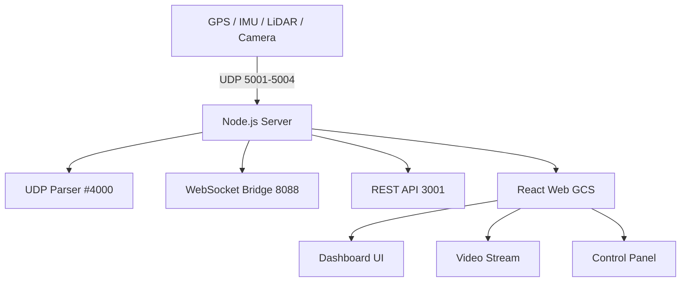
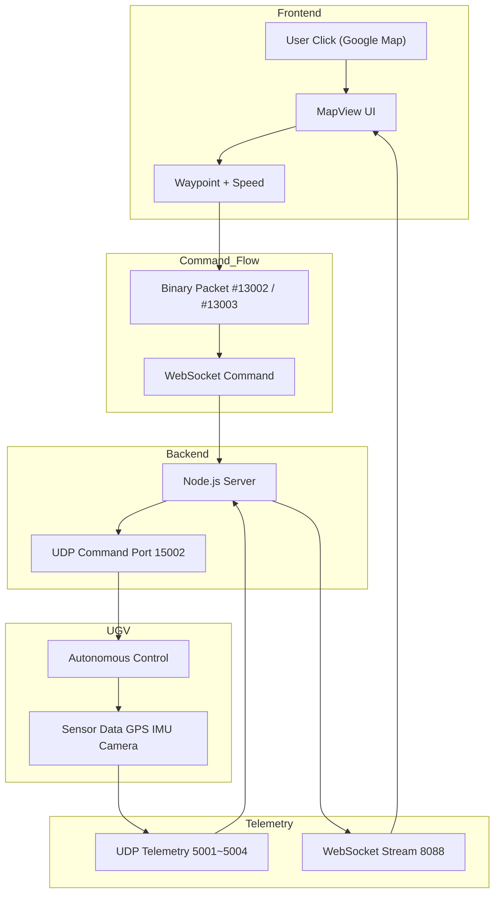

# 🚗 DS LAB - Multi UGV Control System

> ROS 기반 자율주행 UGV와 웹 기반 GCS를 통합한  
> **실시간 다중 로봇 관제 시스템**

---

## 📌 Overview

DS LAB 프로젝트는 다중 UGV(무인 지상 차량)와 GCS(Ground Control Station) 간의  
**실시간 양방향 통신 시스템**을 구축하는 프로젝트입니다.

ROS 기반 자율주행 시스템과 Node.js / React 기반 웹 시스템을 연동하여  
센서 데이터 수집, 영상 스트리밍, 원격 제어까지 통합한 **통합 관제 플랫폼**을 구현했습니다.

---

## 🎯 Key Features

### 📡 Real-time Telemetry
- GPS / IMU / LiDAR 데이터 수집 및 전송
- UDP 기반 저지연 스트리밍

### 🎥 Live Video Streaming
- 카메라 데이터 WebSocket 전송
- 브라우저 실시간 렌더링

### 🎮 Remote Control
- UDP 기반 제어 명령 전송
- AUTO / MANUAL 모드 지원

### 🤖 Multi-UGV Management
- 다중 로봇 상태 관리
- 실시간 클라이언트 모니터링

---

## 🏗️ Architecture (UGV ---> Web_DashBorad)

---

## 개발환경
- Ros1 mellodic
- Python
- React , Node.js

---

## UI 수정

- Total_page 수정
- Operation_page 수정 
---

- Total_page 개선사항 

---

---

## 🚗 Autonomous Navigation

사용자는 Total Page 우측의 Google Map UI에서 목표 지점을 직관적으로 선택할 수 있으며,  
선택된 좌표는 속도 파라미터와 함께 UGV로 전송됩니다.  

- 📍 Map Click → 목표 좌표 설정  
- ⚙️ Speed Control → 주행 속도 설정  
- 📡 Command Transmission → UGV로 실시간 전송  

이를 통해 사용자는 별도의 복잡한 입력 없이  
직관적인 인터페이스 기반으로 자율 주행을 제어할 수 있습니다.

## 🏗️ Architecture (Web_DashBorad ---> UGV)

---

